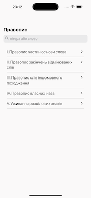
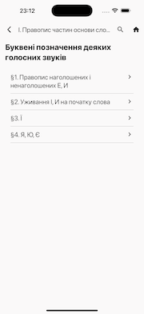
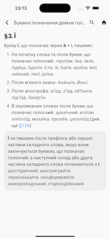
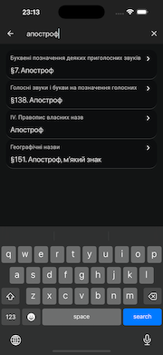

# Pravopys/Правопис
Pravopys/Правопис is a mobile application designed to be a reference book for the grammar of the Ukrainian language. The app is available for free and is intended for use "AS IS".

   

## Features
- **Search** by title
- **Themes** for day and night

## Privacy Policy
See [Privacy Policy](policy.md)

## Dedicated to
- [Юрій Пасіхов](https://www.facebook.com/pasichov) teacher of programming, who inspired me to become an engineer
- [Наталія Бабенкова](https://www.facebook.com/profile.php?id=100013106176714), teacher of Ukrainian language, whose lessons I remember to this day
 